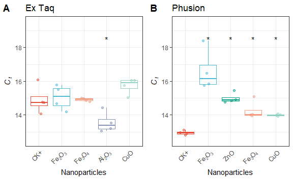

Read data
=========

``` r
library(tidyverse)
library(ggsci)
library(ggrepel)
library(cowplot)
library(rstatix)
library(ggpubr)

results <- read_csv("data/RT-PCR_results.csv")
```

    ## Warning: Missing column names filled in: 'X1' [1]

``` r
amplification <- read_csv("data/RT-PCR_amplification.csv")
```

    ## Warning: Missing column names filled in: 'X1' [1]

``` r
# NP Labels
np_labels <- c("CK"    = expression(paste(CK,"+")),
               "Fe2O3" = expression(paste(Fe[2],O[3])),
               "ZnO"   = expression(paste(ZnO)),
               "CeO2"  = expression(paste(Ce,O[2])),
               "Fe3O4" = expression(paste(Fe[3],O[4])),
               "Al2O3" = expression(paste(Al[2],O[3])),
               "CuO"   = expression(paste(CuO)),
               "TiO2"  = expression(paste(Ti,O[2])))
# color value
color_values <- pal_npg("nrc")(length(np_labels))
names(color_values) <- names(np_labels)

amplification$nps <- factor(amplification$nps, levels = names(np_labels))
results$nps <- factor(results$nps, levels = names(np_labels))
# DNA polymerase Labels
enzyme_labels <- c("extaq" = "Ex Taq","phusion" = "Phusion")
```

``` r
# enzyme labeller
enzyme_labeller <- function(enzyme){
  return(as.character(enzyme_labels[enzyme]))
}
# Y-axis Labels
fancy_scientific <- function(l) {
  # turn in to character string in scientific notation
  l <- format(l, scientific = TRUE)
  # quote the part before the exponent to keep all the digits
  l <- gsub("^(.*)e", "'\\1'e", l)
  # turn the 'e+' into plotmath format
  l <- gsub("e", "%*%10^", l)
  # remove +
  l <- gsub("\\+","",l)
  # return this as an expression
  parse(text=l)
}
```

Visualization
=============

Amplication curve - Figure 2
----------------------------

``` r
amplification <- amplification %>%  mutate(label=as.character(np_labels[as.character(nps)]))

Ct_cutoff <- c(12800,60100)
names(Ct_cutoff) <- c("extaq","phusion")

plots <- lapply(c("extaq","phusion"), function(x){
  ggplot(filter(amplification,enzyme==x),aes(Cycle,mean,color=nps,group=nps)) + 
    geom_line(size=1,show.legend = F) + 
    geom_hline(yintercept = Ct_cutoff[[x]],lty="dashed") + 
    geom_errorbar(aes(ymin=mean-sd,ymax=mean+sd),show.legend = F) +
    labs(title = enzyme_labeller(x)) + 
    geom_text_repel(mapping = aes(x=42,label=label,color=nps),
                    data = filter(amplification,Cycle==40,enzyme==x),
                    direction = "y",xlim=c(40,47),segment.alpha = 0,
                    box.padding = 0.1,
                    parse = T,show.legend = F,hjust=0) + 
    xlim(c(NA,47)) +  ylab("Rn") +  
    scale_y_continuous(labels=fancy_scientific) + 
    scale_color_manual(values = color_values,name="NPs") +
    theme_bw() + theme(legend.position = "none")
})


plot_grid(plotlist = plots,labels = "AUTO")
```


``` r
ggsave("Figure 2.png",path = "plots",dpi=300)
```

    ## Saving 10 x 6.18 in image

### Comparison of Ct values - Figure 3

``` r
plots <- lapply(c("extaq","phusion"), function(x){
  data <- results %>% select(enzyme,nps,CT) %>% filter(enzyme==x)
  if (x == "extaq"){
    aov <- aov(CT~nps,data=data)
    test_result <- tukey_hsd(aov) %>% 
      filter(group1=="CK") %>%
      mutate(p.signif=cut(p.adj,breaks = c(-Inf,0.05,Inf),labels = c("*","")))    
  }
  else {
    test_result <- compare_means(CT~nps,data,ref.group = "CK")
  }

  ggplot(data,aes(nps,CT,color=nps)) + 
    geom_boxplot(show.legend = F,outlier.alpha = 0,alpha=I(1/2)) + 
    geom_jitter(show.legend = F,alpha=1/2,width = 0.25) +
    geom_text(aes(x=group2,label=p.signif),y=18.5,data = test_result,
               inherit.aes = F) +
    labs(title=enzyme_labeller(x)) +  
    scale_color_manual(values = color_values,name="NPs") +
    scale_x_discrete(labels=np_labels) +    
    ylim(c(12.5,19.5)) +
    xlab("Nanoparticles") + ylab(expression(italic(C[t]))) +
    theme_bw() +
    theme(axis.text.x = element_text(angle = 45,vjust = 1,hjust = 1,face = 'bold.italic'),
          axis.line.x = element_blank(),
          axis.ticks.x=element_blank(),
          legend.position = "none")
  
})

plot_grid(plotlist = plots,labels = "AUTO")
```



``` r
ggsave("Figure 3.png",path = "plots",dpi=300)
```

    ## Saving 6 x 3.7 in image
