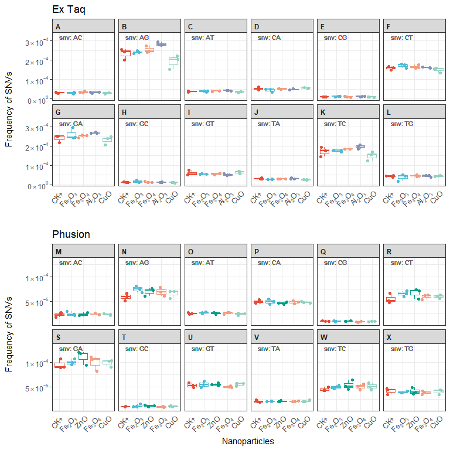

Import, Transform and Tidy
--------------------------

``` r
library(tidyverse)
```

    ## -- Attaching packages --------------------------------------- tidyverse 1.2.1 --

    ## v ggplot2 3.1.1       v purrr   0.3.2  
    ## v tibble  2.1.1       v dplyr   0.8.0.1
    ## v tidyr   0.8.3       v stringr 1.4.0  
    ## v readr   1.3.1       v forcats 0.4.0

    ## -- Conflicts ------------------------------------------ tidyverse_conflicts() --
    ## x dplyr::filter() masks stats::filter()
    ## x dplyr::lag()    masks stats::lag()

``` r
library(ggsci)
library(ggrepel)
library(cowplot)
```

    ## 
    ## Attaching package: 'cowplot'

    ## The following object is masked from 'package:ggplot2':
    ## 
    ##     ggsave

``` r
# error rate and snp frequency were estimated using amplicon sequencing and mothur software
error_rate <- read_csv("data/error_rate.csv")
```

    ## Warning: Missing column names filled in: 'X1' [1]

    ## Parsed with column specification:
    ## cols(
    ##   X1 = col_double(),
    ##   id = col_character(),
    ##   error_rate = col_double()
    ## )

``` r
snp_freq <- read_csv("data/snp_freq.csv")
```

    ## Warning: Missing column names filled in: 'X1' [1]

    ## Parsed with column specification:
    ## cols(
    ##   X1 = col_double(),
    ##   id = col_character(),
    ##   snv = col_character(),
    ##   count = col_double(),
    ##   total = col_double(),
    ##   freq = col_double()
    ## )

``` r
# read meta
meta <- read_tsv("data/meta.txt")
```

    ## Parsed with column specification:
    ## cols(
    ##   id = col_character(),
    ##   enzyme = col_character(),
    ##   nps = col_character(),
    ##   rep = col_character()
    ## )

``` r
# NP Labels
np_labels <- c("CK"    = expression(paste(CK,"+")),
               "Fe2O3" = expression(paste(Fe[2],O[3])),
               "ZnO"   = expression(paste(ZnO)),
               "CeO2"  = expression(paste(Ce,O[2])),
               "Fe3O4" = expression(paste(Fe[3],O[4])),
               "Al2O3" = expression(paste(Al[2],O[3])),
               "CuO"   = expression(paste(CuO)),
               "TiO2"  = expression(paste(Ti,O[2])))
# color value
color_values <- pal_npg("nrc")(length(np_labels))
names(color_values) <- names(np_labels)

# DNA polymerase Labels
enzyme_labels <- c("extaq" = "Ex Taq","phusion" = "Phusion")
```

``` r
# enzyme labeller
enzyme_labeller <- function(enzyme){
  return(as.character(enzyme_labels[enzyme]))
}
# Y-axis Labels
fancy_scientific <- function(l) {
  # turn in to character string in scientific notation
  l <- format(l, scientific = TRUE)
  # quote the part before the exponent to keep all the digits
  l <- gsub("^(.*)e", "'\\1'e", l)
  # turn the 'e+' into plotmath format
  l <- gsub("e", "%*%10^", l)
  # remove +
  l <- gsub("\\+","",l)
  # return this as an expression
  parse(text=l)
}

meta$nps <- factor(meta$nps, levels = names(np_labels))

# join data
error_rate <- left_join(error_rate,meta)
```

    ## Joining, by = "id"

``` r
snp_freq <- left_join(snp_freq,meta)
```

    ## Joining, by = "id"

Data Visualization
------------------

Overall Error Rate - comparing with CK

``` r
plots <- lapply(c("extaq","phusion"), function(x){
  data <- filter(error_rate,enzyme==x)
  ggplot(data, aes(nps,error_rate,color=nps)) + 
    geom_boxplot(show.legend = F) +
    geom_jitter(show.legend=F) + 
    scale_x_discrete(labels=np_labels) +   
    scale_y_continuous(labels=fancy_scientific) +
    scale_color_manual(values = color_values,name="NPs") +
    labs(title=enzyme_labeller(x)) +
    xlab("Nanoparticles") + ylab("Overall Error Rate") +
    theme_bw() +
    theme(axis.text.x = element_text(angle = 45,vjust = 1,hjust = 1,face = 'bold.italic'),
          axis.line.x = element_blank(),
          axis.ticks.x=element_blank(),
          axis.title.y = element_text(margin = margin(t=0,r=15,b=0,l=0)),
          legend.text.align = 0) # 0-left,1-right
})

plot_grid(plotlist = plots,labels = "AUTO")
```


``` r
ggsave("Figure 4.png",dpi = 300,path = "plots")
```

    ## Saving 6 x 3.7 in image

SNV Frequency - comparing with CK For extaq

``` r
plots <- lapply(c("extaq","phusion"), function(x){
  data <- filter(snp_freq,enzyme==x)
  ggplot(data,aes(nps,freq,color=nps)) + 
    geom_boxplot(show.legend=F,outlier.alpha = 0) + 
    geom_jitter(show.legend=F) + 
    geom_text(aes(x="CK",y=max(freq)*1.1,label=paste("snv:",snv,sep=" ")),hjust=0,color="grey40",vjust=0.75,size=3) +
    # facet_wrap(~snv,ncol=6)  + 
    scale_x_discrete(labels=np_labels) +
    scale_y_continuous(labels=fancy_scientific) +
    scale_color_manual(values = color_values,name="NPs") +
    labs(title=enzyme_labeller(x)) +
    xlab("") + ylab("Frequency of SNVs") +
    theme_bw() +
    theme(axis.text.x = element_text(angle = 45,vjust = 1,hjust = 1,face = 'bold.italic'),
          axis.line.x = element_blank(),
          axis.ticks.x=element_blank(),
          axis.title.y = element_text(margin = margin(t=0,r=15,b=0,l=0)),
          strip.placement = "outside",
          strip.text = element_text(face = "bold",hjust = 0),
          legend.text.align = 0) # 0-left,1-right
})
```

Put together

``` r
plots[[1]] <- plots[[1]] + facet_wrap(~snv,ncol=6,labeller = labeller(snv=function(x)paste(LETTERS[1:12])))
plots[[2]] <- plots[[2]] + 
  xlab("Nanoparticles") +
  facet_wrap(~snv,ncol=6,labeller = labeller(snv=function(x)paste(LETTERS[13:24])))

plot_grid(plotlist = plots,ncol=1,align = "v",labels="")
```



``` r
ggsave("Figure 5.png",dpi = 300,path = "plots")
```

    ## Saving 8 x 8 in image
